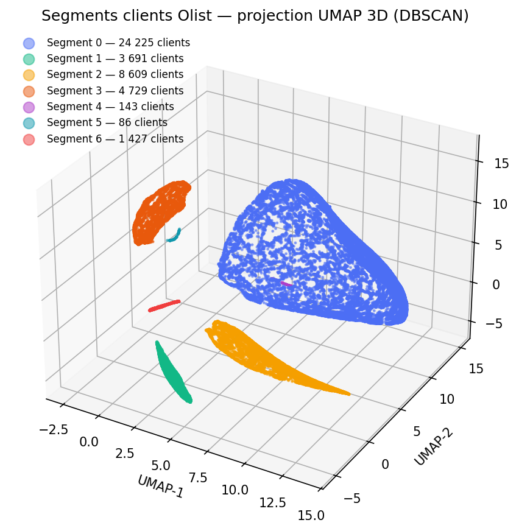

# Segmentation client Olist — de la donnée brute au segment activable

**Segmenter 95 000 clients e-commerce brésiliens en profils marketing exploitables, et savoir quand la segmentation cesse d'être valable.**

Une segmentation qui n'est pas maintenue se périme. Ce projet livre donc les deux moitiés du problème : un pipeline de clustering reproductible (RFM + Satisfaction → UMAP → DBSCAN) **et** la chaîne MLOps qui le surveille — modèle gelé et versionné, prédiction sur nouveaux clients, détection de dérive par PSI, seuil de réentraînement documenté.

| | |
|---|---|
| **Résultat** | 7 segments, 0 % de bruit sur la période de référence |
| **Qualité de clustering** | DBCV = 0,61 (UMAP 3D + DBSCAN, `eps=0.5`, `min_samples=5`) — vs. Silhouette 0,28 pour K-Means |
| **Volume** | 42 910 clients de référence (≤ 2017-12-31), 95 380 clients au total |
| **Fréquence de réentraînement** | **mensuelle** — le DBCV passe sous le seuil de 0,2 en 3 mois |
| **Industrialisation** | modèle picklé + MLflow, 5 tests, `ruff` clean, rapport de dérive JSON |

---

## 📊 Les 7 segments et leurs actions marketing



Profil réel des clusters (médianes R/M, moyennes F/S) — produit par `scripts/05_profile_clusters.py`, données complètes dans [outputs/reports/cluster_personas.csv](outputs/reports/cluster_personas.csv) :

| Segment | Clients | Part | Récence | Panier | Satisfaction | Persona | Action recommandée |
|---|---:|---:|---:|---:|---:|---|---|
| **0** | 24 225 | 56,5 % | 416 j | 105 € | 5,0 | *Satisfaits silencieux* | Programme de réachat / parrainage : le socle à réactiver |
| **2** | 8 609 | 20,1 % | 413 j | 105 € | 4,0 | *Satisfaits sans enthousiasme* | Relance personnalisée, faire basculer vers 5★ |
| **3** | 4 729 | 11,0 % | 394 j | 119 € | 1,0 | *Déçus à fort panier* | **Priorité SAV** : panier le plus élevé, satisfaction la plus basse |
| **1** | 3 691 | 8,6 % | 415 j | 105 € | 3,0 | *Mitigés* | Enquête qualité ciblée avant churn |
| **6** | 1 427 | 3,3 % | 408 j | 110 € | 2,0 | *Insatisfaits* | Geste commercial + traitement du motif d'insatisfaction |
| **4** | 143 | 0,3 % | 740 j | 117 € | 5,0 | *Anciens satisfaits dormants* | Campagne de réactivation « we miss you » |
| **5** | 86 | 0,2 % | 741 j | 117 € | 1,0 | *Anciens perdus* | Ne pas réinvestir : exclure du ciblage payant |

**Lecture métier :** la structure de la clientèle Olist n'est pas une hiérarchie de valeur mais une **hiérarchie de satisfaction**. La fréquence est quasi constante (1,0–1,03 commande) et le panier varie peu (105–119 €) : ce sont le score d'avis, puis l'ancienneté, qui séparent réellement les clients. Conséquence directe : le levier de croissance n'est pas le up-sell, c'est la **récupération des 6 242 clients notés ≤ 2★ (14,5 % de la base, au panier le plus élevé)**.

---

## 🏗️ Architecture

```
CSV Kaggle ──▶ 01_rfms_processing_pipeline ──▶ RFMS parquet
                                                   │
                                    ┌──────────────┴──────────────┐
                                    ▼                             ▼
                        02_cluster_rfms (fit)          04_predict_clusters (score)
                    Yeo-Johnson + RobustScaler          modèle gelé → segment
                       → UMAP 3D → DBSCAN                nouveaux clients
                                    │                             │
                          modèle .pkl + MLflow                    ▼
                                    └──────────────▶ 03_cluster_monitoring (PSI + JS)
                                                        drift_report.json
```

Le prétraitement traite les variables selon leur distribution : Yeo-Johnson + RobustScaler pour `frequency` et `monetary` (asymétries de 11,8 et 9,4), RobustScaler seul pour `recency` et `review_score`. UMAP est retenu car la structure des données est non linéaire — il fait passer le DBCV de 0,39 à 0,61.

---

## 🚀 Reproduire les résultats

```bash
# 1. Données (clé Kaggle requise) + dépendances
./scripts/download-data.sh
poetry install --with dev

# 2. Feature engineering RFMS
poetry run python scripts/01_rfms_processing_pipeline.py
# → data/processed/rfms_active_reviewers.parquet (95 380 clients avec avis)
# → data/processed/rfms_silent_customers.parquet  (clients sans avis)

# 3. Entraînement + tracking (~4 min)
poetry run python scripts/02_cluster_rfms.py --split-date 2017-12-31 \
  --mlflow-tracking-uri file:./mlruns
# → artifacts/models/rfms_clustering.pkl
# → data/clustered/clusters_labels_until_2017-12-31.parquet
# → artifacts/cluster_performance/clustering_performance_until_2017-12-31.json

# 4. Personas + visualisation
poetry run python scripts/05_profile_clusters.py
# → outputs/figures/clusters_umap.png + outputs/reports/cluster_personas.csv

# 5. Scoring de nouveaux clients avec le modèle gelé
poetry run python scripts/04_predict_clusters.py \
  --input data/processed/rfms_active_reviewers.parquet \
  --output data/predictions/rfms_scored.parquet

# 6. Détection de dérive
poetry run python scripts/03_cluster_monotoring.py \
  --reference data/clustered/clusters_labels_until_2017-12-31.parquet \
  --current data/processed/rfms_active_reviewers.parquet
# → artifacts/monitoring/drift_report.json
```

Sortie réelle de l'étape 3 :

```json
{ "split_date": "2017-12-31", "n_observations": 42910,
  "nb_clusters": 7, "noise_ratio": 0.0, "clustered_ratio": 1.0 }
```

---

## 🔄 Maintenance du modèle : quand réentraîner ?

DBSCAN n'a pas de prédiction native : un nouveau client est affecté au **point de cœur le plus proche dans l'espace UMAP** s'il se situe à moins de `eps`, sinon il est étiqueté bruit (`-1`). Le modèle ne se réajuste jamais silencieusement — c'est ce qui rend la dérive mesurable.

**Dérive mesurée** entre la référence (≤ 2017-12-31) et les 52 470 clients de 2018 :

| Variable | PSI | Verdict |
|---|---:|---|
| `recency` | **12,50** | dérive massive |
| `monetary` | 0,007 | stable |
| `review_score` | 0,0001 | stable |
| `frequency` | 0,000 | stable |

La dérive est **entièrement portée par la récence** : les comportements d'achat et la satisfaction, eux, ne bougent pas. C'est une dérive mécanique (arrivée continue de nouveaux clients), pas un changement de clientèle — mais elle suffit à déplacer les points dans l'espace UMAP.

Côté segmentation, la répartition reste en revanche stable à court terme : distance de Jensen-Shannon entre distributions de clusters = **0,047**, 0 % de bruit sur les nouveaux clients ([rapport complet](artifacts/monitoring/drift_report_2018.json)). Autrement dit, la dérive des données précède la dérive des segments — ce qui laisse le temps d'agir avant que la segmentation ne se dégrade.

**Règle de décision retenue** : PSI ≥ 0,20 déclenche `drift_detected`, et le suivi mensuel du DBCV (notebook 03) montre qu'il s'érode dès décembre 2017, oscille jusqu'en février, puis devient **fortement négatif en mars**. D'où la fréquence de maintenance : **réajustement UMAP/DBSCAN tous les mois, deux mois au maximum**, avec un seuil d'alerte à DBCV ≤ 0,2. Le suivi hebdomadaire serait trop bruité, le trimestriel trop grossier.

---

## ✅ Qualité & MLOps

| Pratique | Mise en œuvre |
|---|---|
| **Pipeline reproductible** | `sklearn.Pipeline` complet (prétraitement → UMAP → DBSCAN), `random_state` fixé, seed sélectionné par comparaison de 10 graines × 4 combinaisons métrique/init |
| **Modèle versionné** | Sérialisation pickle + tracking MLflow (params, métriques, artefact) — `poetry run mlflow ui --backend-store-uri ./mlruns` |
| **Séparation train/score** | `fit` sur la période de référence, `predict` sans réajustement, validation explicite des colonnes RFMS et des valeurs nulles |
| **Tests** | 5 tests pytest : agrégations RFMS, validation d'entrées, persistance, prédiction non destructive, dérive stable vs. dégradée |
| **Lint** | `ruff check src tests scripts` — conforme PEP8 |
| **Scalabilité** | Affectation par index `NearestNeighbors` (une matrice de distances dense saturait la mémoire au-delà de ~10 k clients) |

```bash
poetry run pytest -q            # 5 passed
poetry run ruff check src tests scripts
```

Détails : [guide MLOps](docs/MLOPS.md) · [tests](docs/TESTS.md)

---

## 📓 Démarche & notebooks

| Notebook | Contenu |
|---|---|
| [01_eda.ipynb](notebooks/01_eda.ipynb) | Analyse des 5 sources Olist, justification des variables RFM+S, exploration PCA |
| [02_clustering.ipynb](notebooks/02_clustering.ipynb) | Comparaison K-Means / GMM / Agglomerative / DBSCAN / HDBSCAN, recherche `eps` par k-distance, sélection de seed UMAP, DBCV |
| [03_cluster_monitoring.ipynb](notebooks/03_cluster_monitoring.ipynb) | Data drift mensuel (TabularDrift), évolution du DBCV, dérivation de la fréquence de maintenance |
| [04_cluster_profiling.ipynb](notebooks/04_cluster_profiling.ipynb) | Notes de profilage — les personas de production sont générés par `scripts/05_profile_clusters.py` |

**Choix de modèle** (jeu de référence, DBCV sauf mention) :

| Approche | Score | Décision |
|---|---|---|
| K-Means (k=9) | Silhouette 0,28 · ARI 0,63 | Écarté : structure non sphérique, clusters peu séparés |
| DBSCAN sur données brutes | 1 à 4 clusters | Écarté : densité trop hétérogène |
| DBSCAN + UMAP (n_neighbors=50) | **DBCV 0,61** | **Retenu** — 7 segments, 0 % de bruit |

---

## 📐 Variables

Par client (`customer_unique_id`) :

- **Recency (R)** — jours depuis le dernier achat
- **Frequency (F)** — nombre total de commandes
- **Monetary (M)** — montant total dépensé
- **Satisfaction (S)** — score moyen des avis (1–5)

Le **S** est l'ajout déterminant : c'est lui qui structure la segmentation, là où un RFM classique aurait produit des clusters quasi indiscernables sur cette base majoritairement mono-achat.

## 📁 Structure

```
├── artifacts/
│   ├── config/                 # hyperparamètres UMAP + DBSCAN retenus
│   ├── models/                 # modèle gelé (rfms_clustering.pkl)
│   ├── cluster_performance/    # métriques d'entraînement (JSON)
│   ├── monitoring/             # rapports de dérive (JSON)
│   └── metrics_embeddings/     # embeddings de suivi mensuel
├── data/
│   ├── raw/  processed/  clustered/  predictions/
├── notebooks/                  # 01 EDA · 02 clustering · 03 monitoring · 04 profiling
├── outputs/
│   ├── figures/                # projections UMAP, corrélations
│   └── reports/                # personas CSV, animations de dérive HTML
├── scripts/                    # 01 → 05, pipeline exécutable
├── src/olist_ecommerce_client_clustering/
│   ├── model.py                # RFMSClusteringModel (fit / transform / predict / save)
│   └── monitoring.py           # PSI + distance de Jensen-Shannon
├── tests/  docs/  pyproject.toml
```

## 📚 Données source

Dataset Olist (~100 k commandes, 2016–2018) : `orders`, `customers`, `order_items`, `order_payments`, `order_reviews`.


```
@misc{olist_andr__sionek_2018,
	title={Brazilian E-Commerce Public Dataset by Olist},
	url={https://www.kaggle.com/dsv/195341},
	DOI={10.34740/KAGGLE/DSV/195341},
	publisher={Kaggle},
	author={Olist and André Sionek},
	year={2018}
}
```
